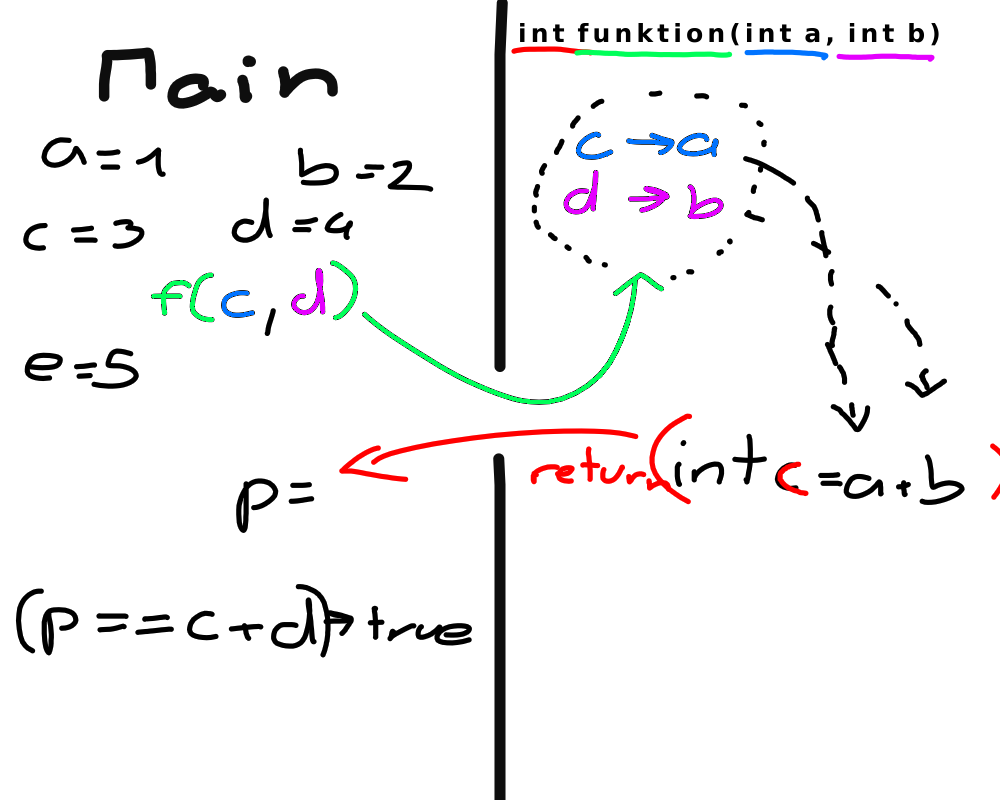
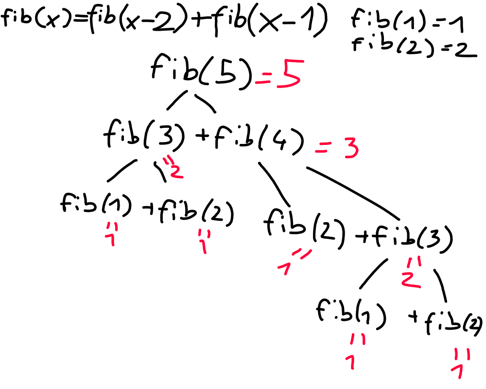

+++
title = 'Einrichtung und Rekursion'
date = 2024-10-07T13:30:21+02:00
draft = false
+++
# Funktion
Um zu verstehen, was die Rekursion ist und wie man sich richtig verwenden kann,
muss man sich erst einmal mit dem Baustein der Rekursion beschäftigen. Der
Funktion. Hierbei kann man sich vorstellen, dass sich das ganze Programm in
einem Raum abspielt, den wir MAIN nennen. Alle Variablen, welche sich in diesem
Raum befinden, sind für uns zugänglich und wir koennen mit ihnen machen was wir
wollen. Rufen wir allerdings eine Funktion auf, wirkt das, als wuerde wir eine
weitere Türe eröffnen und nur bestimmte Variablen in diesen Raum einladen. Dort
können wir sie dann wieder neu benennen, aber wichtig ist, dass diese keine
Verbundenheit mit den ursprünglichen Werten haben und auch nur die eingelassen
werden, welche speziell eingeladen wurden.


# Rekursion

Die Rekursion ist jetzt, wenn sich die Funktion, in sich selber, nochmal
aufruft, das bedeutet einen weiteren Raum erzeugt, in welchen bestimmte
Variablen eingeladen werden und dann wieder ausgegeben werden. Damit wir
allerdings nicht unendlich viele Räume erstellen, sondern irgendwann einmal
Aufhören, müssen wir etwas, genannt den Basisfall definieren. Das bedeutet, wenn
ein bestimmtes Szenario zu tritt, ruft sich die Funktion nicht wieder selbst
auf, sondern gibt direkt etwas zurück.
## Bsp Fibonacci Wir wissen ja, diese
Reihe geht so 1,1,2,3,5,8 … . Definiert ist sie so f(x) = f(x-2) + f(x - 1), das
bedeutet, jedes Mal, wenn wir die Funktion aufrufen müssen, ruft sie sich selbst
zwei Mal nochmal auf. Wir wissen nur von Anfang an, dass die Basis Fälle, also
die Fibonacci-Zahl, an erster und zweiter Stelle 1 sind. Dementsprechend können
wir so einen Baum zeichnen.




Unten findet ihr noch Aufgaben und den C++ Code welchen wir in der Stunde geschrieben haben und nicht vergessen die 3 Regeln der Rekursion.
## 1. Was machen deine Variablen
Welche importiertes du und warum importiert du diese Variablen, welche exportiert du(return) und was sollen sie besagen
## 2. Was ist dein Basisfall
Wann soll die Rekursion stoppen, also definieren schon mal das Scenario, bei der Fibunacci waren es ja wenn n == 1 || n == 2
## 3. Vertraue der Rekursion
Wenn du dein Programm schreibst, tu so, als ob du schon eine Funktion besitzen würdest, die genau das macht, was du sie gern gemacht haben würdest.
```
// Aufgabe: Berechne die nte Fibonacci Nummer mit Rekursion
// Input: Ein int n wobei 1 <= n <= 1000
// Output: Den Wert der nten Fibonacci Nummer modulo 10e9 + 7

// 1. Regel: Was machen die Variablen?
// 2. Regel: Was ist der Basisfall?
// 3. Regel: Die Rekursion funktioniert schon

#include <bits/stdc++.h>
using namespace std;
#define l long long


// Nte Fibonacci nummer ausrechnen
// Return: integer
// a: Der Index der fibonacci Nummer, die man ausrechnen will
int fib(int a) {
    // Basisfaelle
    if (a == 1) return 1;
    if (a == 2) return 1;

    int solution = fib(a-1) + fib(a-2);
    return solution;
} 


int main() {

    l n;
    cin >> n;

    cout << fib(n) << endl;


    return 0;
}
```


## Problems
- Factorials
- [Fibonacci](https://www.spoj.com/problems/FIBOSUM/)
- [Tower of Harnoi](https://cses.fi/problemset/task/2165)
